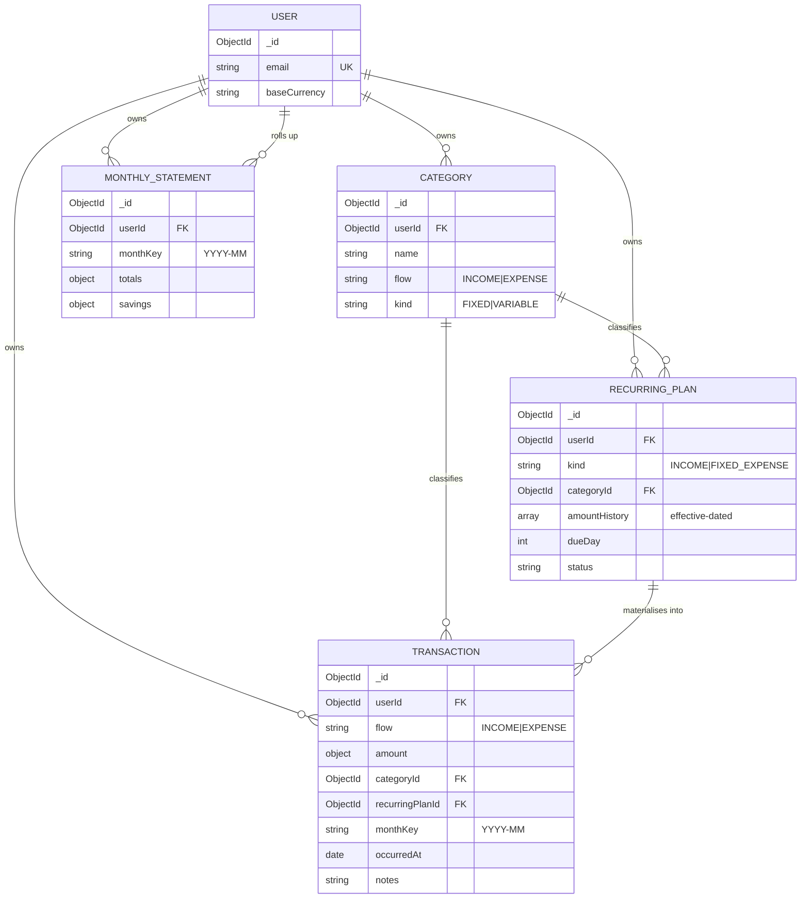

Acting as Principal Software Architect / Data Architect. Here's a MongoDB architecture tailored to those exact features. Design only — no files written.

The central modeling decision: **separate "what recurs" from "what actually happened."** Income sources and fixed expenses are *recurring plans* (definitions that repeat monthly and are editable). Variable expenses are *transactions* (discrete events). Savings and analytics are **derived** and precomputed into per-month rollups so the dashboard reads one document instead of scanning the ledger.

Everything is `userId`-scoped (multi-tenant ready) and money is stored as **integer minor units** (`amountMinor` + `currency`) to avoid float drift.

---

## Collections overview



| Collection | Holds | Write freq | Read pattern |
|---|---|---|---|
| `users` | account + preferences | rare | on login |
| `categories` | dynamic categories (fixed & variable) | low | list on load |
| `recurringPlans` | income sources + fixed expenses (editable, monthly) | low | list + monthly materialisation |
| `transactions` | variable expenses + actual income/expense events | high | paginated feed + aggregation |
| `monthlyStatements` | precomputed per-month rollup (savings, totals) | 1×/month/user (+ on edit) | dashboard, history, forecast |
| `insights` *(future/AI)* | generated insights | async | dashboard |

---

## Schemas

### 1. `users`

```typescript
{
  _id: ObjectId,
  email: string,            // unique
  passwordHash: string,
  displayName: string,
  baseCurrency: 'USD' | 'EUR' | 'GBP' | 'BDT' | 'INR',
  preferences: {
    locale: string,
    monthStartDay: number,   // 1 = calendar month; supports pay-cycle months
    theme: 'dark' | 'light' | 'system'
  },
  createdAt: Date,
  updatedAt: Date
}
```

### 2. `categories` — dynamic, covers fixed AND variable

`flow` = income vs expense; `kind` = fixed vs variable. This lets "future fixed expenses" be a pure data operation (add a category + a plan), never a schema change.

```typescript
{
  _id: ObjectId,
  userId: ObjectId,
  name: string,                 // "Rent", "Groceries", "Freelance"
  flow: 'INCOME' | 'EXPENSE',
  kind: 'FIXED' | 'VARIABLE',
  color: string,                // "#22c55e"
  icon: string,                 // icon registry key
  isArchived: boolean,          // soft-delete; preserves history
  createdAt: Date,
  updatedAt: Date
}
```

### 3. `recurringPlans` — income sources + fixed expenses (unified)

Both income and fixed expenses are "a named amount that repeats monthly and is editable." Unifying them removes duplicated logic. **Editability without losing history** is solved with an *effective-dated `amountHistory`* array — you never overwrite an amount, you append a new effective period. This is what makes historical analysis and forecasting accurate.

```typescript
{
  _id: ObjectId,
  userId: ObjectId,
  kind: 'INCOME' | 'FIXED_EXPENSE',
  categoryId: ObjectId,          // e.g. Rent, Salary, WiFi, Loan, Credit Card
  name: string,                  // "Apartment rent", "Acme salary"

  // Effective-dated amounts — edit = append, never mutate.
  amountHistory: [
    {
      amount: { amountMinor: 120000, currency: 'USD' },
      effectiveFrom: '2026-01',   // monthKey (YYYY-MM), inclusive
      effectiveTo: null           // null = current; set when superseded
    }
  ],

  cadence: 'MONTHLY',            // extensible: WEEKLY | QUARTERLY | YEARLY
  dueDay: number,               // 1..31, day of month it's expected
  status: 'ACTIVE' | 'PAUSED' | 'ENDED',
  startMonth: string,           // "2026-01"
  endMonth: string | null,      // null = open-ended (loans set this)
  autoPost: boolean,            // auto-create a transaction each month?
  createdAt: Date,
  updatedAt: Date
}
```

> Rent, Maid, Electricity, WiFi, Loan, Credit Card = `kind: FIXED_EXPENSE` rows, each linked to its category. Multiple salaries/freelance = multiple `kind: INCOME` rows. "Editable" = append to `amountHistory`.

### 4. `transactions` — the ledger (actuals)

Every real movement: variable expenses (with notes/date/amount), one-off income, and the materialised monthly occurrences of recurring plans (`recurringPlanId` set). `monthKey` is a **denormalised bucket key** for O(1) monthly grouping. `categorySnapshot` denormalises category display fields so the feed is a single-collection read.

```typescript
{
  _id: ObjectId,
  userId: ObjectId,
  flow: 'INCOME' | 'EXPENSE',
  amount: { amountMinor: 4599, currency: 'USD' },
  categoryId: ObjectId,
  categorySnapshot: { name: 'Groceries', color: '#22c55e', icon: 'cart', kind: 'VARIABLE' },
  recurringPlanId: ObjectId | null,  // set when generated from a plan
  description: string,
  notes: string | null,              // variable-expense notes
  tags: string[],
  occurredAt: Date,                  // when money actually moved
  monthKey: string,                  // "2026-07" — derived from occurredAt on write
  createdAt: Date,
  updatedAt: Date
}
```

### 5. `monthlyStatements` — precomputed rollup (Computed Pattern)

The heart of dashboard analytics, savings tracking, historical analysis and forecasting. One doc per user per month. Savings = income − expenses, precomputed so the dashboard never recomputes over the whole ledger.

```typescript
{
  _id: ObjectId,
  userId: ObjectId,
  monthKey: string,                  // "2026-07"  (unique with userId)
  currency: 'USD',
  totals: {
    income:        { amountMinor: 520000, currency: 'USD' },
    fixedExpense:  { amountMinor: 180000, currency: 'USD' },
    variableExpense:{ amountMinor: 145000, currency: 'USD' },
    totalExpense:  { amountMinor: 325000, currency: 'USD' },
    remaining:     { amountMinor: 195000, currency: 'USD' }   // income - totalExpense
  },
  savings: {
    amount:   { amountMinor: 195000, currency: 'USD' },
    ratePct:  37.5                    // savings / income * 100
  },
  categoryBreakdown: [                // for the pie/bar without re-aggregating
    { categoryId: ObjectId, name: 'Groceries', total: { amountMinor: 45000, currency:'USD' }, sharePct: 13.8 }
  ],
  forecast: {                         // written by the forecasting job
    projectedSavings: { amountMinor: 210000, currency: 'USD' },
    method: 'WMA_3',                  // weighted moving avg, 3 months
    confidencePct: 72
  },
  computedAt: Date,
  version: 1                          // Schema Versioning Pattern
}
```

---

## Indexes

Every index is `userId`-prefixed → tenant working sets stay partitioned and the prefix doubles as the future shard key.

```javascript
// users
db.users.createIndex({ email: 1 }, { unique: true });

// categories
db.categories.createIndex({ userId: 1, flow: 1, kind: 1, isArchived: 1 });

// recurringPlans
db.recurringPlans.createIndex({ userId: 1, kind: 1, status: 1 });
db.recurringPlans.createIndex({ userId: 1, categoryId: 1 });

// transactions  (the hot collection)
db.transactions.createIndex({ userId: 1, occurredAt: -1 });            // feed
db.transactions.createIndex({ userId: 1, monthKey: 1, flow: 1 });      // monthly rollup
db.transactions.createIndex({ userId: 1, categoryId: 1, monthKey: 1 });// per-category trend
db.transactions.createIndex({ userId: 1, recurringPlanId: 1, monthKey: 1 },
                            { partialFilterExpression: { recurringPlanId: { $exists: true } } });
db.transactions.createIndex({ userId: 1, tags: 1 });

// monthlyStatements
db.monthlyStatements.createIndex({ userId: 1, monthKey: -1 }, { unique: true }); // history + upsert target
```

The `{ userId, monthKey, flow }` index is what makes the monthly aggregation an index-covered scan rather than a collection scan.

---

## Relationships

- **Reference, don't embed, across aggregates.** Transactions reference `categoryId`/`recurringPlanId` by ObjectId. Aggregates stay small and independently extractable to services later.
- **Selective denormalisation for read speed:** `categorySnapshot` on transactions and `categoryBreakdown` on statements. Source of truth remains `categories`; a rename triggers a background fan-out update (rare event, favours the hot read path).
- **`recurringPlans` → `transactions`** is 1-to-many: each active plan materialises one transaction per month (via `autoPost` job or user confirmation), linked by `recurringPlanId` so you can reconcile "planned vs actual."
- **`monthlyStatements`** is a projection over `transactions` + `recurringPlans` — derived, regenerable, never a source of truth.

---

## Aggregation strategies

**A. Monthly dashboard (on-demand or to refresh a statement):**

```javascript
db.transactions.aggregate([
  { $match: { userId, monthKey: '2026-07' } },
  { $group: {
      _id: '$flow',
      total: { $sum: '$amount.amountMinor' },
      count: { $sum: 1 }
  }},
  // → { INCOME: x }, { EXPENSE: y };  remaining = x - y in the service layer
]);
```

**B. Category breakdown (pie chart):**

```javascript
db.transactions.aggregate([
  { $match: { userId, monthKey: '2026-07', flow: 'EXPENSE' } },
  { $group: { _id: '$categoryId', total: { $sum: '$amount.amountMinor' },
              name: { $first: '$categorySnapshot.name' } } },
  { $sort: { total: -1 } }
]);
```

**C. Historical savings trend (fast — reads precomputed statements, not the ledger):**

```javascript
db.monthlyStatements.find(
  { userId, monthKey: { $gte: '2026-01', $lte: '2026-12' } },
  { monthKey: 1, 'savings.amount': 1, 'totals.income': 1, 'totals.totalExpense': 1 }
).sort({ monthKey: 1 });
```

**Two-tier strategy:** heavy grouping runs **once per month** (or on an edit that affects the month) via the **Computed Pattern** into `monthlyStatements`; all dashboard/history reads then hit that tiny pre-aggregated collection. This keeps p95 dashboard latency flat regardless of ledger size.

**D. Savings forecasting** — run over `monthlyStatements` (small, ordered series):
- **Baseline:** 3-month **weighted moving average** of `savings.amount` (recent months weighted higher) — cheap, robust, computed in a scheduled job and written back to `statement.forecast`.
- **Trend:** simple **linear regression** (least squares) over the last N months for slope/direction in "trend analysis."
- **Phase 2 (AI):** feed the same ordered statement series to the assistant as structured context, or Atlas time-series/ML for seasonality. The forecast contract already lives on the statement, so upgrading the algorithm never changes the read API.

---

## Scalability recommendations

| Area | Recommendation |
|---|---|
| **Shard key** | `{ userId: 1, monthKey: 1 }` on `transactions` — co-locates a user's month, spreads users across shards, matches every query prefix. |
| **Computed Pattern** | Precompute `monthlyStatements`; never aggregate the full ledger on the read path. Single biggest scalability lever. |
| **Bucket Pattern (optional)** | For power users with huge volumes, bucket transactions per `userId+monthKey` into arrays to cut document count and index size. Start unbucketed; adopt only if profiling demands it. |
| **Archiving / tiering** | Move statements/transactions older than N years to Atlas **Online Archive** (cheap, still queryable) to keep the hot working set small. |
| **Effective-dated edits** | `amountHistory` avoids destructive updates → historical months stay reproducible without event-sourcing overhead. |
| **Schema versioning** | `version` field on documents enables zero-downtime migrations (read-time upcasting). |
| **Read scaling** | Serve analytics/history from Atlas **secondary read replicas**; add Redis cache for the current-month dashboard (phase 2). |
| **Write scaling** | `transactions` is the only high-write collection; keep it lean (references, not embeds) and let the shard key distribute load. |
| **Integrity** | Mongo has no cross-doc FKs — enforce referential rules (category exists, currency matches) in the **domain/application layer**, and use transactions (multi-doc) when materialising a plan + updating its statement together. |
| **Multi-user / AI readiness** | `userId` everywhere = flip to SaaS with no remodeling; pre-aggregated, integer-money, ISO-dated statements = ideal, cheap AI context and tool inputs. |

---

### Why this shape wins for your features
- **Multiple/editable/monthly income** → `recurringPlans(kind:INCOME)` with `amountHistory`.
- **Fixed expenses incl. future ones** → `recurringPlans(kind:FIXED_EXPENSE)` — new ones are data, not schema.
- **Variable expenses (categories/notes/dates/amount)** → `transactions` + dynamic `categories`.
- **Savings tracking / history / forecasting** → precomputed `monthlyStatements` + forecast job.
- **Dashboard analytics** → one statement read for totals/remaining/savings/trends.
- **Multi-user + AI** → `userId` scoping + structured, pre-aggregated contracts already in place.

Want me to turn this into concrete **Mongoose schemas + DTOs** in the codebase next, or refine any collection (e.g. add `goals`/`debts` modeling for the loan/credit-card payoff tracking)?
